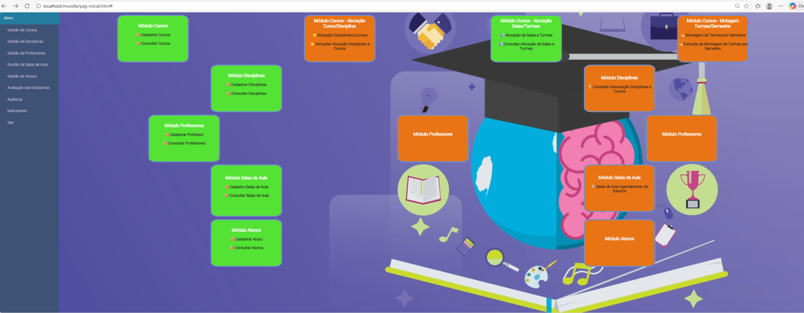

# PHP_SISTEMA_GESTAO_SENAC

<p align="center">
  
</p>

## Descrição
PHP_SISTEMA_GESTAO_SENAC é um projeto web desenvolvido como prática de estudo, utilizando **PHP, HTML, CSS, JavaScript e jQuery**, integrado a um banco de dados **MySQL** rodando no **XAMPP**.  
O sistema visa consolidar conhecimentos em desenvolvimento web, manipulação de dados e integração com banco de dados.

---

## Tecnologias Utilizadas
- **Frontend:** HTML5, CSS3, JavaScript, jQuery  
- **Backend:** PHP  
- **Banco de Dados:** MySQL (XAMPP)  
- **Versionamento:** Git / GitHub  
- **IDE:** VS Code / Sublime / PHPStorm

---

## Login de teste

Para facilitar o teste do sistema, utilize:

Usuário: adm

Senha: adm

Ambos são “adm” para login rápido.

---

## Como Executar o Projeto
1. **Clone o repositório:**
```bash
git clone https://github.com/SmalleyAraujo/PHP_SISTEMA_GESTAO_SENAC.git

